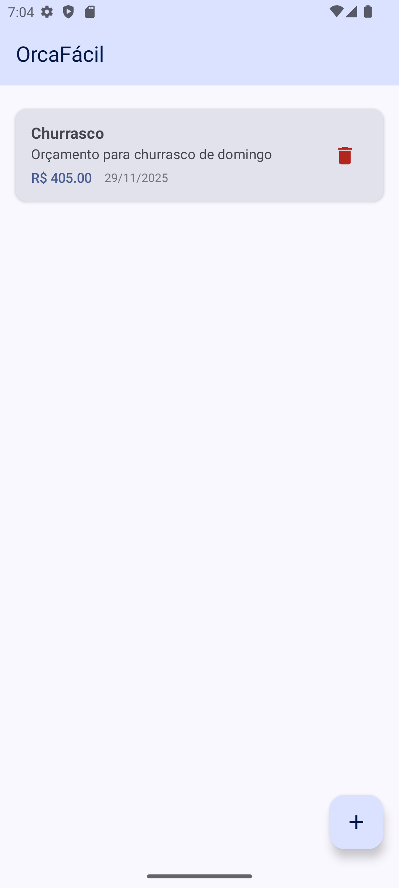
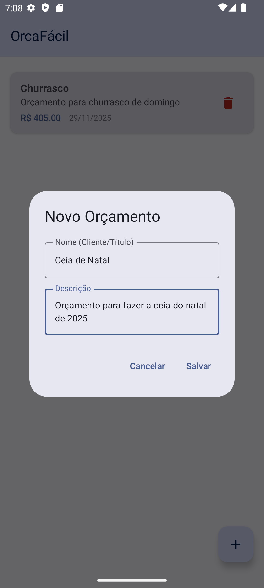
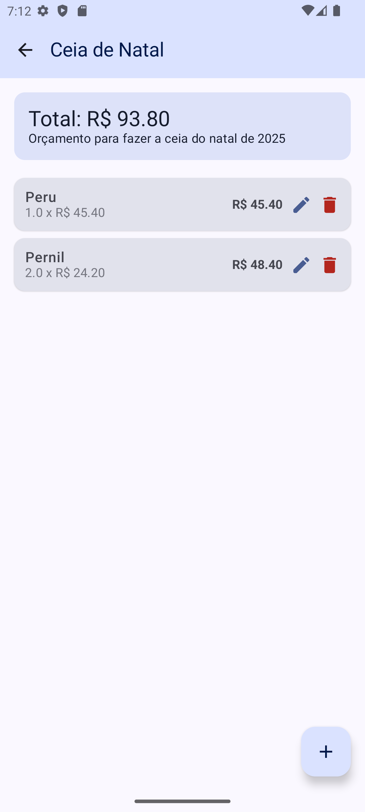
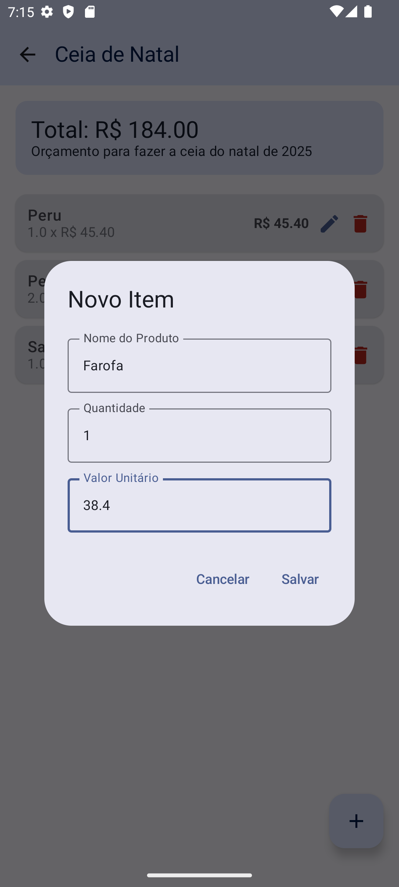

# 3. Metodologia

A metodologia adotada para o desenvolvimento do **OrcaFacilApp** baseou-se nas práticas recomendadas de Engenharia de Software Moderna, com foco específico no desenvolvimento nativo para a plataforma Android. O processo foi estruturado em etapas incrementais, abrangendo desde a configuração do ambiente até a implementação da lógica de negócios e interface do usuário.

## 3.1 Ferramentas e Ambiente de Desenvolvimento

O projeto foi desenvolvido utilizando o **Android Studio Ladybug**, a IDE oficial da Google para desenvolvimento Android. O sistema de build utilizado foi o Gradle, configurado através da linguagem **Kotlin DSL** (`build.gradle.kts`), que oferece melhor autocompletar e verificação de erros nos scripts de configuração em comparação com o Groovy tradicional. A linguagem de programação escolhida foi o **Kotlin**, visando compatibilidade total com as bibliotecas modernas do Android Jetpack.

Para o controle de versão, utilizou-se o **Git**, seguindo um fluxo de trabalho simplificado baseado em *feature branches*, onde cada nova funcionalidade (como a criação de telas ou lógica de banco de dados) foi desenvolvida em um ramo isolado antes de ser integrada ao ramo principal.

## 3.2 Arquitetura da Solução

A arquitetura do aplicativo segue o padrão **MVVM (Model-View-ViewModel)**, recomendado pela Google para garantir a separação de interesses e facilitar testes automatizados.

1.  **Model (Camada de Dados):** Responsável pela persistência e recuperação de dados. Utilizou-se a biblioteca **Room** para criar um banco de dados SQLite local. Foram definidas duas entidades principais: `Budget` (Orçamento) e `BudgetItem` (Itens do Orçamento), com um relacionamento de um-para-muitos.
2.  **Repository:** Atua como uma fonte única da verdade, mediando o acesso aos dados entre o banco de dados (DAO) e a camada de apresentação.
3.  **ViewModel:** Gerencia o estado da interface do usuário e executa a lógica de negócios. Os ViewModels (`HomeViewModel` e `BudgetDetailViewModel`) expõem dados observáveis através de `StateFlow`, garantindo que a UI reaja automaticamente a mudanças nos dados.
4.  **View (Interface de Usuário):** Construída inteiramente com **Jetpack Compose**, eliminando o uso de arquivos XML de layout. A UI é composta por funções *Composable* modulares e reutilizáveis.

## 3.3 Fluxo de Funcionamento e Telas

O fluxo do aplicativo foi desenhado para ser intuitivo e direto. Abaixo, apresentamos as principais telas desenvolvidas e suas funcionalidades.

### 3.3.1 Tela Principal (Home)

A tela inicial apresenta a listagem de todos os orçamentos cadastrados no sistema, ordenados pela data de criação. Caso não existam orçamentos, um "Empty State" amigável orienta o usuário a criar o primeiro registro.

*Figura 1: Tela Principal do OrcaFacilApp exibindo a lista de orçamentos.*

### 3.3.2 Cadastro de Orçamento

Ao acionar o botão de ação flutuante (FAB) na tela principal, o usuário é apresentado a um diálogo para inserir o nome e a descrição do novo orçamento. A validação básica impede a criação de orçamentos sem nome.

*Figura 2: Formulário para criação de um novo orçamento.*

### 3.3.3 Detalhes e Adição de Itens

Ao selecionar um orçamento, o usuário é direcionado para a tela de detalhes. Nesta tela, é possível visualizar o valor total acumulado e a lista de itens. Um novo botão de ação permite adicionar produtos ou serviços ao orçamento, especificando nome, quantidade e valor unitário. O sistema recalcula o total automaticamente após cada inserção.

*Figura 3: Tela de detalhes exibindo itens e valor total calculado.*

*Figura 4: Interface para inserção de novos itens ao orçamento.*

## 3.4 Testes e Validação

Durante o desenvolvimento, foram realizados testes manuais exploratórios para validar cada funcionalidade implementada. O uso de injeção de dependência com **Hilt** facilitou a estruturação do código, preparando o terreno para futuros testes unitários automatizados. A validação final consistiu na verificação do fluxo completo: criação de orçamento -> adição de itens -> persistência dos dados -> reinicialização do app para confirmar que os dados foram salvos corretamente no banco de dados SQLite.
